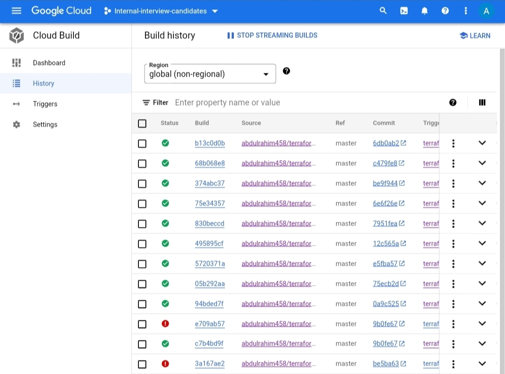
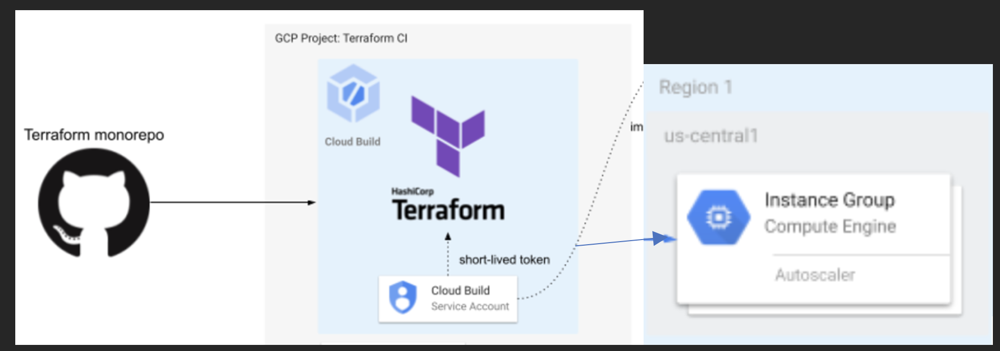

# Deploying GCP VMs located in a private subnet, inside a managed instance group, with a load balancer and autoscaling using Terraform
https://www.figma.com/file/X5VzA4Kgu2Q1euqjO18p9H/CV-%2F-Resume-template-(Community)?node-id=0%3A1&t=tQ78Bg0ivwkjQjYR-0

VPC 

End-Point Output: http://34.107.199.130:8080

The CloudBuild Pipelines will Plan and deploy a load balancer with autoscaling and deploy Ubuntu server with Apache in private subnet, without public ip, inside an managed instance group, using Terraform.

lb-managed.tf --> Create managed instance group, backend services and all components required by the load balancer 

lb-managed-variables.tf --> Load balancer variables

network-firewall.tf --> Configure basic firewall for the network

network-variables.tf --> Define network variables

network.tf --> Define network, vpc, subnet, icmp firewall

provider.tf --> Configure Google Cloud provider

terraform.tfvars --> Defining variables 

variables-auth.tf --> Application and authentication variables

vm-output.tf --> Output of VMs 

vm.tf --> Template to create a Ubuntu VM with Apache web server

Terraform Apply

     
